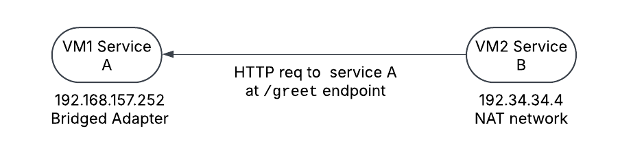

---

# Microservices Deployment in VirtualBox 

**Student Name:** Aditya Trivedi 

**Course/Project:** Cloud Computing & Virtualization Assignment  

---

## 1. Introduction

The objective of this assignment was to create and configure multiple virtual machines (VMs) using Oracle VirtualBox, set up networking between them, and deploy a simple microservice-based application. The final deliverables include:
- A detailed report (this document)
- An Network diagram of the deployed simple system
- A GitHub repository containing the source code and deployment configuration
- A recorded video demonstration of the process


---

## 2. Environment Setup and VirtualBox Installation

### a. VirtualBox Installation
- **Download:** I downloaded the latest version of VirtualBox from the [Oracle VirtualBox website](https://www.virtualbox.org/).
- **Installation:** The installation was straightforward, following the on-screen instructions. The extension pack was also installed to enable advanced networking features and USB support.

### b. Ubuntu Installation on VM
- **ISO Verification:** I downloaded the Ubuntu Server ISO and verified its checksum using the provided SHA256 hash to ensure file integrity.
- **VM Creation:**  
  - I created a new VM named "First Ubuntu VM 24.04" with the following settings:
    - **Type:** Linux, Ubuntu (64-bit)
    - **RAM:** 4092 MB (minimum recommended for Ubuntu Server)
    - **Virtual Hard Disk:** A dynamically allocated VDI of 25 GB
  - The ISO file was attached as a boot medium, and the default boot order was set to boot from the optical drive.
- **Installation Issues:**  
  - During the installation, I initially encountered an error (which turned out to be due to insufficient resources and an incorrect boot order). I resolved it by increasing the allocated memory and verifying that the boot order prioritized the ISO image.

---

## 3. Creating and Cloning Virtual Machines

### a. Original VM Setup
- The "First Ubuntu VM 24.04" VM was successfully installed and updated via:
  ```bash
  sudo apt update && sudo apt upgrade -y
  ```
- Essential packages such as Git and curl were installed:
  ```bash
  sudo apt install git curl -y
  ```

### b. Cloning the VM
- To simulate a microservice architecture with two VMs, I cloned the "First Ubuntu VM 24.04" VM.
- **Problem Encountered:**  
  After cloning, both VMs showed the same MAC address (and hence received the same IP address) when connected to my configured NAT network (192.34.34.0/24).  
- **Reason:**  
  - I discovered that VirtualBox clones by default copy the original VM’s MAC address.
  - Using the VBoxManage command-line tool, I reinitialized the MAC address for the cloned VM:
    ```bash
    VBoxManage modifyvm "Ubuntu-Clone" --macaddress1 080027A1B2C3
    ```
  - Alternatively, I also edited the “Ubuntu-Clone.vbox” configuration file manually (after backing it up) to update the `<Adapter slot="1" ... MACAddress="...">` value.
- **Outcome:**  
  After changing the MAC address and renewing the DHCP lease (using `sudo dhclient -r && sudo dhclient` inside the guest), the cloned VM still had the same IP
- **Solution**
  I then i decided to keep two different VMs with different network configs one with Bridged  adapter and other with NAT network so that both VMs have same Ip addresses.

### c. Network Adapter Configuration Summary
- **VM for Service B (Greeting Service):**  
  - **Network Mode:** Bridged Adapter  
  - **IP Address:** 192.34.34.4  
  - **Reason:** Bridged mode was chosen so that this VM appears as a full member of the physical network.
- **VM for Service A (Time Service):**  
  - **Network Mode:** NAT Network (with a custom network configured as 192.34.34.0/24)  
  - **IP Address:** 192.168.157.252  
  - **Reason:** NAT mode provides an isolated internal network while still enabling internet connectivity.



---

## 4. Microservice Application Deployment

I developed a simple microservices application using Node.js and Express that consists of two services communicating with each other.

### a. Application Overview
- **Service B – Greeting Service:**  
  - **Port:** 3000  
  - **Function:** Provides a `/greet` endpoint that calls Service B to obtain the current time and then returns a greeting message.
  - **Deployed on:** VM with **NAT network** (IP: 192.34.34.4)
- **Service A – Time Service:**  
  - **Port:** 3001  
  - **Function:** Provides a `/time` endpoint that returns the current server time in ISO format.
  - **Deployed on:** VM with **Bridged Adapter** (IP: 192.168.157.252)

### b. Code Details

#### Service A – Time Service
- **Directory:** `service-a/`
- **package.json:**
  ```json
  {
    "name": "service-a",
    "version": "1.0.0",
    "description": "Time service microservice",
    "main": "index.js",
    "scripts": {
      "start": "node index.js"
    },
    "dependencies": {
      "express": "^4.18.2"
    }
  }
  ```
- **index.js:**
  ```javascript
  const express = require('express');
  const app = express();
  const port = process.env.PORT || 3001;

  app.get('/time', (req, res) => {
      const currentTime = new Date().toISOString();
      res.json({ time: currentTime });
  });

  app.listen(port, () => {
      console.log(`Service A (Time Service) listening on port ${port}`);
  });
  ```

#### Service B – Greeting Service
- **Directory:** `service-b/`
- **package.json:**
  ```json
  {
    "name": "service-b",
    "version": "1.0.0",
    "description": "Greeting service microservice",
    "main": "index.js",
    "scripts": {
      "start": "node index.js"
    },
    "dependencies": {
      "axios": "^1.3.4",
      "express": "^4.18.2"
    }
  }
  ```
- **index.js:**
  ```javascript
  const express = require('express');
  const axios = require('axios');
  const app = express();
  const port = process.env.PORT || 3000;

  // The SERVICE_B_URL should be set to the IP of the VM running Service A.
  // In our setup, set SERVICE_A_URL=http://192.34.34.4:3001
  const serviceAUrl = process.env.SERVICE_A_URL || 'http://localhost:3001';

  app.get('/greet', async (req, res) => {
      try {
          // Fetch current time from Service B
          const response = await axios.get(`${serviceAUrl}/time`);
          const time = response.data.time;
          res.json({ greeting: `Hello! The current time is ${time}` });
      } catch (error) {
          console.error('Error fetching time from Service A:', error);
          res.status(500).json({ error: 'Could not retrieve time from Service A' });
      }
  });

  app.listen(port, () => {
      console.log(`Service B (Greeting Service) listening on port ${port}`);
  });
  ```

### c. Deployment Steps on the VMs

- **For Service A (Time Service):**
  1. On the VM with NAT network (IP: 192.168.157.252), open a terminal.
  2. Clone the GitHub repository:
     ```bash
     git clone https://github.com/adit4443ya/microservice_vcc.git
     cd microservice_vcc/service-a
     ```
  3. Install dependencies:
     ```bash
     npm install
     ```
  4. Start the service:
     ```bash
     npm start
     ```
- **For Service B (Greeting Service):**
  1. On the VM with bridged adapter (IP: 192.34.34.4), open a terminal.
  2. Clone the repository:
     ```bash
     git clone https://github.com/adit4443ya/microservice_vcc.git
     cd microservice_vcc/service-b
     ```
  3. Set the environment variable so that Service A knows where to reach Service B:
     ```bash
     export SERVICE_A_URL=http://192.168.157.252:3001
     ```
     (On Windows, use `export SERVICE_A_URL=http://192.168.157.252:3001` in Command Prompt.)
  4. Install dependencies:
     ```bash
     npm install
     ```
  5. Start the service:
     ```bash
     npm start
     ```

### d. Testing the Application
- **Service A:**  
  From any terminal (or browser) on the VM (or via port forwarding from the host), access:
  ```
  http://192.168.157.252:3001/time
  ```
  You should receive a JSON response with the current time.

- **Service B:**  
  From a terminal or browser on the VM or host, access:
  ```
  http://192.34.34.4:3000/greet
  ```
  This endpoint will fetch the time from Service A and return a greeting message.

- **Inter-VM Communication:**  
  Verify that Service B (on the NAT VM) can reach Service A (on the bridged VM) by checking logs and using tools like `curl`:
  ```bash
  curl http://192.168.157.252:3000/greet
  ```

---

## 5. Difficulties and Troubleshooting

### a. Ubuntu Installation Issues
- **Problem:**  
  Initial installation errors occurred due to resource allocation and boot order misconfigurations.
- **Resolution:**  
  - Increased VM RAM allocation.
  - Verified boot order to ensure the ISO was prioritized.
  - Checked the ISO checksum to confirm file integrity.

### b. Cloning and Duplicate MAC Addresses
- **Problem:**  
  When cloning the VM, both clones inherited the same MAC address, causing them to receive the same IP address from the DHCP server.
- **Resolution:**  
  - Used VBoxManage with the command  
    ```bash
    VBoxManage modifyvm "Ubuntu-Clone" --macaddress1 080027A1B2C3
    ```  
    to generate a new MAC address.
  - When the GUI option was not clickable, I manually edited the VM’s `.vbox` configuration file.
  - After keeping two different network configurations i got different IP addresses.

### c. Network Adapter Modes
- **Approach:**  
  - Configured one VM to use NAT network mode (resulting in IP 192.34.34.4) and the other to use Bridged Adapter mode (resulting in IP 192.168.157.252).
- **Testing:**  
  - Verified connectivity using `ifconfig`, `ip addr`, and `ping` between the VMs.
  - Ensured that the NAT network was correctly configured with the custom subnet (192.34.34.0/24).

### d. Microservice Communication Setup
- **Problem:**  
  Setting the correct environment variable for inter-service communication.
- **Resolution:**  
  - In Service A’s startup process, the environment variable `SERVICE_A_URL` was set to `http://192.168.157.252:3001`.
  - This allowed Service A to successfully call Service B’s `/greet` endpoint.

---

## 6. Conclusion

In summary, the assignment was completed successfully by:
- Installing VirtualBox and configuring Ubuntu VMs.
- Troubleshooting installation and cloning issues (duplicate MAC addresses) using VBoxManage and manual editing of configuration files.
- Configuring one VM with a NAT network (IP: 192.34.34.4) and the other with a bridged adapter (IP: 192.168.157.252).
- Deploying a simple Node.js microservices application with Service B (Greeting Service) and Service A (Time Service).
- Validating inter-VM communication and ensuring that Service B could retrieve data from Service A.

---

## 7. Deliverables

- **Source Code Repository:**  
  [https://github.com/adit4443ya/microservice_vcc](https://github.com/adit4443ya/microservice_vcc)
- **Video Demo:**  
  [Video on Drive](https://drive.google.com/drive/folders/1IePJX70imxnjcvDvwfNcipCgATsZyH7c?usp=sharing)
- **Plagiarism Clause:**  
  > *I hereby declare that the implementation, code, documentation, and all associated materials submitted as part of this assignment are entirely my own original work.*
---
